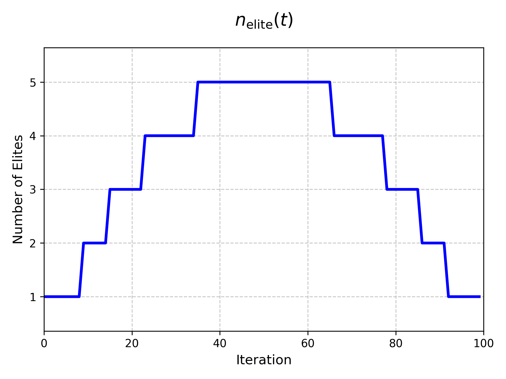
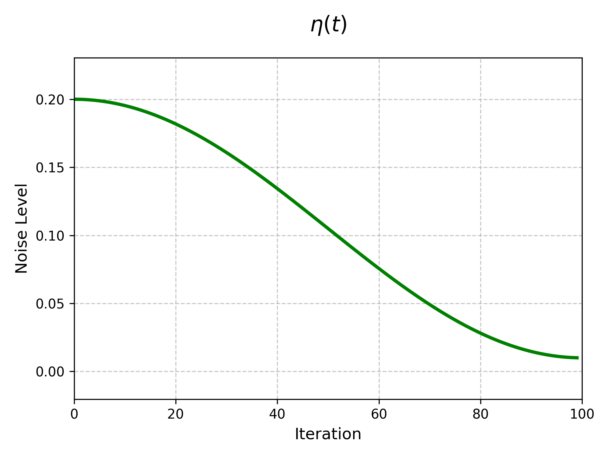
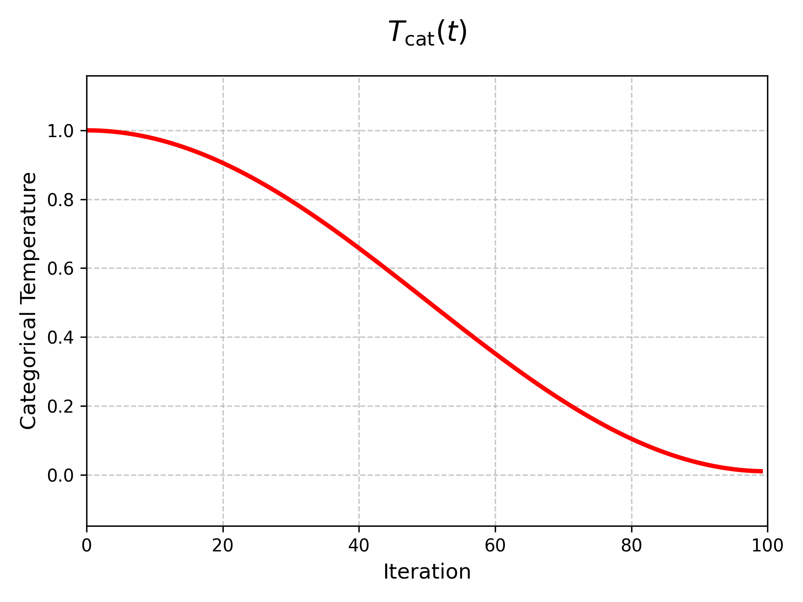

# Algorithm Overview

## **1. General Structure of the Algorithm**

This method conducts an iterative search over a parameter space that may contain **continuous**, **integer**, and **categorical** variables. Its main components are:

1. **Elite Selection**  
   A set of the best-performing trials (based on the objective function) is selected at each iteration. These are the “elites.”

2. **Noise Perturbation**  
   New candidate solutions are generated by perturbing the parameters of these elite trials with a noise term that adapts over time.

3. **Noise Annealing**  
   The noise level is decreased as the number of iterations increases, often using a cosine-annealing schedule. This ensures broader exploration at the beginning and more focused exploitation later on.

4. **Categorical Handling**  
   Categorical parameters are internally represented via one-hot encoding. A softmax function (with a temperature parameter) is used to stochastically choose among possible categories based on the (perturbed) mean of elite vectors.

5. **Integer Handling**  
   Integer parameters are sampled as continuous values and then probabilistically rounded to the nearest integers.

Let:
- \(N\) be the total number of iterations (trials).
- \(t\) be the index of the current iteration, with \(0 \le t < N\).
- \(p_t = \frac{t}{N}\) be the **progress ratio**.

---

## **2. Number of Elite Trials \(\,n_{\text{elite}}\)**

At each iteration \(t\), the number of elite trials selected to guide the next sample can be defined by a function that depends on the progress ratio \(p_t\). One commonly used form is:

\[
n_{\text{elite}}(t) 
\;=\; 
\max \Bigl(1,\; 
\text{round} \bigl(\,\alpha \,\sqrt{N}\,\cdot\,p_t\cdot\bigl(1 - p_t\bigr)\bigr)
\Bigr),
\]

where:
- \(\alpha\) is a constant (for example, \(\alpha = 2\)) that scales according to the total number of trials \(N\).  
- The factor \(p_t\,(1 - p_t)\) creates a bell-shaped curve over \(t\in[0,N]\), reaching its maximum around \(t \approx \frac{N}{2}\).  
- The use of \(\max(1,\,\dots)\) ensures that at least one trial is always considered elite.

### **Visualizing \(n_{\text{elite}}(t)\)**  
If desired, a plot of \(n_{\text{elite}}(t)\) against \(t\) can show how the number of elite trials starts near 0 or 1 at \(t=0\), grows to a maximum in the middle iterations, and then decreases again near \(t=N\).

---

## **3. Noise Scheduling with Cosine Annealing**

Let \(\eta_{\text{init}}\) be the **initial noise** (e.g., \(0.2\)) and \(\eta_{\text{final}} = \frac{1}{N}\) be the **final noise** (or another chosen small value). At iteration \(t\), define a **cosine annealing** factor:

\[
\text{cos\_anneal}(t) 
\;=\; 
0.5 \,\bigl(1 + \cos\bigl(\pi \,p_t\bigr)\bigr),
\]
where \(p_t = \frac{t}{N}\).

Then, the noise level \(\eta(t)\) can be updated as:
\[
\eta(t) 
\;=\; 
\eta_{\text{final}}
\;+\;
\bigl(\,\eta_{\text{init}} \;-\; \eta_{\text{final}}\bigr)\,\text{cos\_anneal}(t).
\]

- When \(t\) is close to 0, \(p_t=0\), so \(\cos(\pi \, p_t)=1\) and \(\eta(t)\approx \eta_{\text{init}}\).  
- Near \(t = N\), \(\cos(\pi \, p_t)=-1\), so \(\eta(t)\approx \eta_{\text{final}}\).  

Hence, the noise transitions gradually from a larger initial value down to a smaller final value.

### **Visualizing \(\eta(t)\)**  
A plot of \(\eta(t)\) across iterations \(t\) typically shows a smooth curve descending from \(\eta_{\text{init}}\) at \(t=0\) to \(\eta_{\text{final}}\) at \(t=N\).

---

## **4. Continuous and Integer Parameters**

### **4.1. Continuous Variables**

For a continuous variable \(x\) in the range \([\,\text{low},\,\text{high}\,]\), new samples may first be drawn randomly (uniformly or log-uniformly) during early iterations. Once enough iterations have passed, the algorithm exploits the elite solutions:

1. **Select an Elite Value**  
   One of the elite trials (in terms of objective value) is chosen at random. Let its parameter be \(x_{\text{elite}}\).

2. **Add Noise**  

   Draw a random value \(\delta \sim \mathcal{N}(0,\;\sigma)\), where \(\sigma\) depends on \(\eta(t)\) and possibly the range \(\text{high}-\text{low}\). A typical approach is:  
   
    \[
    x_{\text{new}} = 
    x_{\text{elite}} 
    + 
    \delta \cdot \bigl(\text{high} - \text{low}\bigr) \cdot \eta(t).
    \]

3. **Reflect at Boundaries**  
   If \(x_{\text{new}}\) goes below \(\text{low}\) or above \(\text{high}\), it is reflected back into the valid range, for instance by:
   \[
   \text{while } x_{\text{new}} < \text{low} \text{ or } x_{\text{new}} > \text{high:}
   \quad
   \begin{cases}
   x_{\text{new}} = \text{high} - (\,x_{\text{new}} - \text{high}\,)/2 &\text{if } x_{\text{new}}>\text{high},\\
   x_{\text{new}} = \text{low} + (\,\text{low} - x_{\text{new}}\,)/2 &\text{if } x_{\text{new}}<\text{low}.
   \end{cases}
   \]

### **4.2. Integer Variables**

To handle an integer parameter in \(\{ \text{low},\ldots,\text{high}\}\), one can:

1. Sample a **continuous** value as above, obtaining \(v\).  
2. Let \(\lfloor v \rfloor\) be the floor of \(v\) and \(f = v - \lfloor v \rfloor\) be its fractional part.  
3. Draw \(u\) from a uniform distribution \(\text{U}(0,1)\).  
4. If \(u < f\), set the integer value to \(\lceil v \rceil\). Otherwise, set it to \(\lfloor v \rfloor\).

Thus, a value close to 10.7 is more likely to become 11 than 10, while a value close to 10.2 is more likely to become 10 than 11.

---

## **5. Categorical Parameters: One-Hot and Softmax**

Categorical parameters are represented as **one-hot vectors**. Suppose there are \(k\) possible categories \(c_1, c_2, \dots, c_k\). Each trial stores a vector of length \(k\), e.g., \([1,0,0]\) if category \(c_1\) is chosen, \([0,1,0]\) if \(c_2\) is chosen, etc.

### **5.1. Averaging and Noise**

Let \(\mathbf{v}_1, \mathbf{v}_2, \dots, \mathbf{v}_{n_{\text{elite}}}\) be the one-hot vectors of the best \(n_{\text{elite}}(t)\) trials. Compute the component-wise mean:

\[
\overline{\mathbf{v}}
\;=\;
\frac{1}{\,n_{\text{elite}}(t)} 
\sum_{i=1}^{n_{\text{elite}}(t)}
\mathbf{v}_i.
\]

Then add Gaussian noise \(\mathbf{z}\) with scale \(\eta(t)\), typically ensuring the result stays within \([0,\,1]\) by reflection if necessary.

### **5.2. Temperature and Softmax**

A temperature parameter \(T_{\text{cat}}(t)\) is introduced to control how sharply categories are chosen. One approach is to define

\[
T_{\text{cat}}(t)
\;=\;
\frac{1}{\,\eta_{\text{final}} + (1-\eta_{\text{final}})\,\text{cos\_anneal}(t)},
\]
where
\[
\text{cos\_anneal}(t) 
\;=\;
0.5\,\bigl(1 + \cos(\pi p_t)\bigr).
\]

After adding noise to \(\overline{\mathbf{v}}\), each component \(m_j\) represents the “score” for category \(j\). These scores are converted to probabilities \(\{\pi_1,\dots,\pi_k\}\) via a softmax scaled by \(T_{\text{cat}}(t)\):

\[
\pi_j
\;=\;
\frac{\exp\!\bigl(m_j\,T_{\text{cat}}(t)\bigr)}
{\sum_{r=1}^k \exp\!\bigl(m_r\,T_{\text{cat}}(t)\bigr)},
\quad
j=1,\dots,k.
\]

Finally, a category \(c_j\) is sampled with probability \(\pi_j\), and the corresponding one-hot vector is set to \([0,\dots,1,\dots,0]\) with 1 at position \(j\).

#### **Visualizing \(T_{\text{cat}}(t)\)**  
If desired, a plot of \(T_{\text{cat}}(t)\) against \(t\) can show how the categorical temperature starts high at \(t=0\), allowing broad exploration, then gradually decreases, focusing more on the best categories over time.

---

## **6. Iterative Procedure**  
Let:
- \(N\) be the total number of iterations (trials).
- \(n_{\text{init\_points}}\) be the number of initial trials that are sampled purely at random (commonly \(\text{round}(\sqrt{N})\) if not specified).
- \(t\) be the index of the current iteration, with \(0 \le t < N\).
- \(p_t = \frac{t}{N}\) be the **progress ratio**.

At **each iteration** \(t\) (from 0 up to \(N-1\)):

**If \(\,t < n_{\text{init\_points}}\):**  
- **Randomly sample** all parameters (continuous, integer, and categorical) within their valid ranges.  
- Skip steps 2, 3, and 4 below (since no elite-based adaptation is used yet).

**Otherwise** (\(t \ge n_{\text{init\_points}}\)):  

1. **Compute Progress**:  
   \[
   p_t \;=\; \frac{t}{N}.
   \]

2. **Determine Elite Count**:  
   \[
   n_{\text{elite}}(t) 
   \;=\; 
   \max \Bigl(1,\; 
   \text{round}\bigl(\alpha\,\sqrt{N}\,\cdot\,p_t\,(1 - p_t)\bigr)\Bigr),
   \]

3. **Update Noise (Cosine Annealing)**:  
   \[
   \eta(t) 
   \;=\; 
   \eta_{\text{final}}
   \;+\;
   \bigl(\eta_{\text{init}} - \eta_{\text{final}}\bigr) 
   \times
   0.5\,\bigl(1 + \cos(\pi\,p_t)\bigr).
   \]

4. **Handle Parameters**:  
   - **Continuous**: Select an elite value, add \(\mathcal{N}(0,\sigma)\) noise scaled by \(\eta(t)\) and reflect if out of bounds.  
   - **Integer**: Same as continuous, but use *probabilistic rounding* (fractional part decides rounding up/down).  
   - **Categorical**: Form an average one-hot vector from the elites, add noise, apply a temperature-based softmax, then pick a category.

5. **Evaluate Objective**:  
   - Pass the newly sampled parameter set to the objective function for a score.

6. **Update Ranking**:  
   - Keep track of the best \(n_{\text{elite}}(t)\) trials (“elites”) for the next iteration.

This process repeats until \(t = N\). Early in the search (\(t < n_{\text{init\_points}}\)), the algorithm explores broadly by drawing random samples. Once \(t \ge n_{\text{init\_points}}\), it transitions to the adaptive phase: higher noise in the beginning encourages wide exploration, whereas lower noise in later iterations focuses the search around the most promising solutions found so far.

---

## **Additional Notes** 

- **Reflections at Boundaries**  
  Ensuring that samples do not remain outside a valid range often involves a “mirror” or “reflect” step.  
- **Log-Scale Sampling**  
  If a parameter is specified as log-scaled \(\in [\text{low}, \text{high}]\), sampling can be done in \(\log\)-space, i.e., \(\exp\bigl(\text{Uniform}(\log(\text{low}),\,\log(\text{high}))\bigr)\).  
- **Temperature**  
  When \(\eta(t)\) becomes small, \(T_{\text{cat}}(t)\) becomes large, so the softmax distribution becomes more “peaked” around the best categories discovered.

