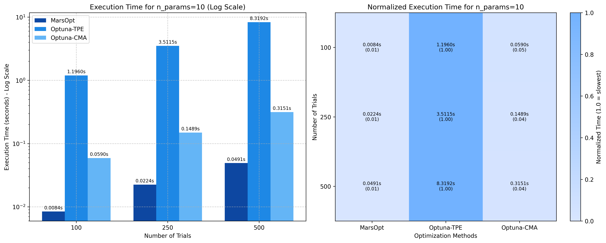
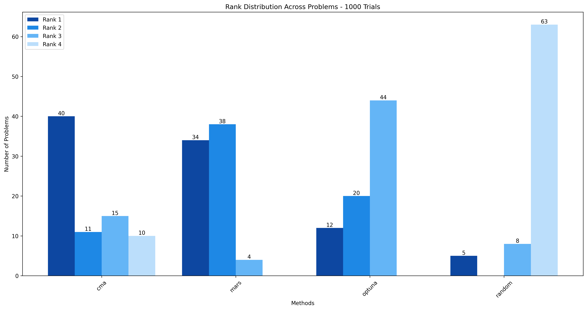
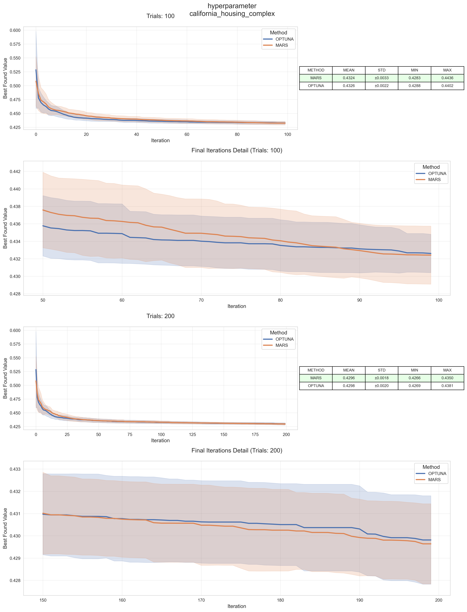

# Performance Analysis


## 1. Timing Analysis

Our approach demonstrates a significant performance advantage over **Optuna's TPE** in terms of optimization speed. To evaluate this, we conducted 10 independent trials using a simple objective function designed to minimize the sum of 10 suggested floating-point parameters. This setup ensures that the function evaluation overhead remains minimal, allowing us to focus purely on the optimization speed.

Our method achieves up to **150× faster performance** compared to Optuna. The results are so drastic that we had to use a logarithmic scale on the **y-axis** in the visualization; otherwise, the difference would have been too extreme to display effectively.

 


## 2. Blackbox Optimization Experiments

We utilized [SigOpt evalset](https://github.com/sigopt/evalset/tree/main), which provides predefined optimization problems.  

For each problem in blackbox optimization, we conducted 30 runs with different random seeds to compare the average performance of different algorithms. The comparison included:
- CMA-ES
- Optuna
- Random Search
- MARS (our algorithm)

### Results at Different Iterations:

#### 100 Iterations


The results show that MARS significantly outperformed other algorithms.

#### 1000 Iterations



CMA-ES took the lead, though its results were  close to MARS's performance.

## 3. LightGBM Hyperparameter Optimization

We compared two different objective functions for hyperparameter optimization using LightGBM on the California Housing dataset:

### Simple vs Complex Objective Differences:

#### Simple Objective
* Uses only GBDT (Gradient Boosting Decision Tree) as the boosting type
* Has a narrower parameter search space
* Optimizes basic parameters such as:
  - L1/L2 regularization
  - Learning rate
  - Number of leaves
  - Feature and bagging fractions
  - Minimum child samples


#### Complex Objective
* Allows selection between GBDT and GOSS (Gradient-based One-Side Sampling) boosting types
* Features a wider parameter search space
* Includes additional parameters such as:
  - Top rate and other rate (for GOSS)
  - Maximum depth
  - Maximum bin
  - Additional tuning options for both boosting types




```{note}
Only a small subset of the experiments is shared on this page, for detailed plots, results and the test scripts please visit [OneDrive](https://1drv.ms/f/s!AlBVgxlOqiYLmleqSUdV-UfckAlG?e=T35onP).
```